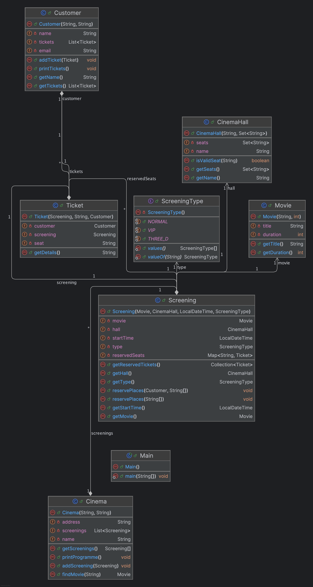

# Multiplex Booking System

This project is a Java implementation of a business model for a multiplex cinema system. It supports multiple cinema locations, each with multiple screening halls, and provides functionality for:

- Booking seats in advance for screenings.
- Purchasing tickets in advance, either anonymously or for registered customers.
- Viewing the screening schedule (repertoire) for the upcoming week.
- Supporting special screening types, such as VIP and 3D.
- Retrieving and displaying reserved tickets for customers.
- Finding movies by partial title search.

## Features

- **Multiple Cinema Locations:** The system is designed to manage two or more cinemas within one application.
- **Advance Seat Reservation:** Reserve seats before the screening starts.
- **Ticket Purchasing:** Buy tickets with or without a customer account.
- **Weekly Programme Display:** View all screenings scheduled in the next seven days.
- **Special Screening Types:** Handle VIP and 3D screenings.
- **Customer Ticket Management:** Registered customers can check their booked tickets.
- **Movie Search:** Find movies by providing a partial title.

## Project Structure

The project consists of several classes, each placed in its own file:

- **ScreeningType.java**  
  An enum representing the screening types: `NORMAL`, `VIP`, and `THREE_D`.

- **Cinema.java**  
  Represents a cinema (multiplex) which contains multiple screenings. Provides methods to add screenings, print the weekly programme, and search for movies.

- **Screening.java**  
  Represents a movie screening with details such as the movie, cinema hall, start time, and screening type. It also handles seat reservation.

- **CinemaHall.java**  
  Represents a cinema hall with a set of seats. It verifies whether a seat exists in the hall.

- **Movie.java**  
  Represents a movie with a title and duration (in minutes).

- **Customer.java**  
  Represents a registered customer. Customers can have a list of booked tickets and view them.

- **Ticket.java**  
  Represents a ticket for a specific screening and seat. It includes details about the screening and, if applicable, the customer.

- **Main.java**  
  Contains a demonstration of the system usage. It shows how to set up a cinema, add screenings, perform reservations (both anonymous and for a registered customer), print the programme, and search for movies.

## UML Diagram

